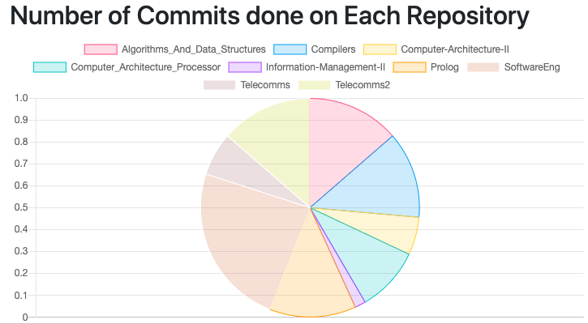
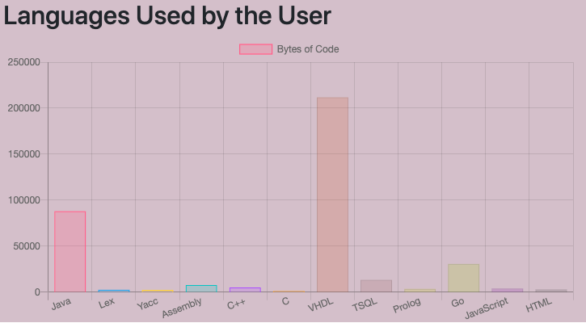
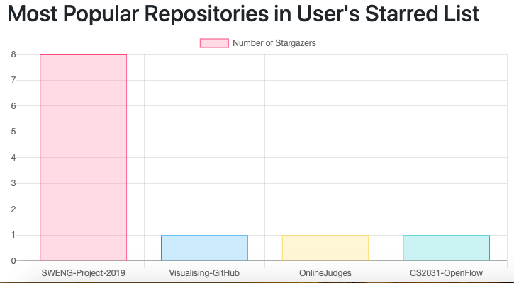

# Github-Visualisation-Javascript

Install Node.js and type this in terminal to install it 
```sudo npm install http-server -g```

To run the files, type this in terminal
```http-server .```

Using a web browser, go to 
```localhost:80```

Then you will need to enter a Username and a Personal Aunthentication Token that can be obtained from the Github Website.
```https://docs.github.com/en/free-pro-team@latest/github/authenticating-to-github/creating-a-personal-access-token```


# Result
The first graph of the project visualises the information showing which repostiories the user has worked the most in. It is done by counting the number of commits made per repository.



The second graph of the project visualises the information regarding User's profficiency in different programming languages. 



The third graph visualises the most popular repositories from the user's starred list. The popularity is measured by seeing the no. of stargazers of that project.


